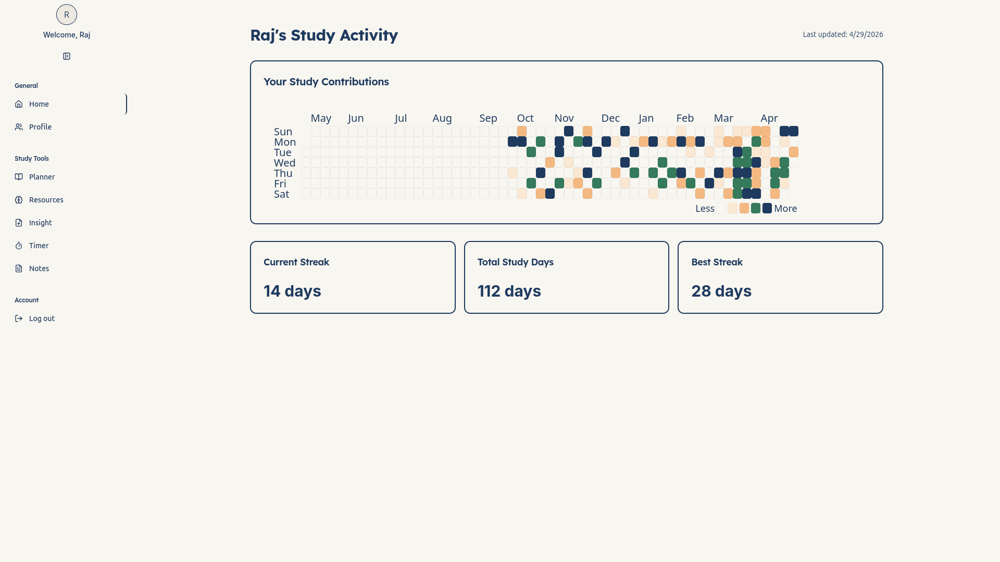
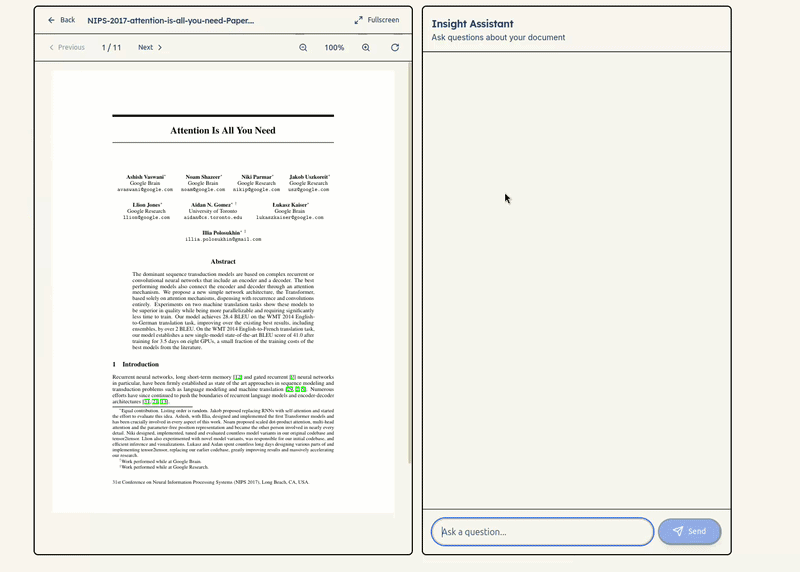

<div align="center">
  

  # 🎓 AcademicIQ

  **An AI-Powered Hub for Lifelong Learners**

  [](https://nextjs.org/)
  [](https://nodejs.org/)
  [](https://mongodb.com/)
  [](https://tailwindcss.com/)
  [](LICENSE)

  <p align="center">
    <a href="#-features">Features</a> •
    <a href="#-tech-stack">Tech Stack</a> •
    <a href="#%EF%B8%8F-getting-started">Getting Started</a> •
    <a href="#-usage-flow">Usage Flow</a> •
    <a href="#-contributing">Contributing</a>
  </p>
</div>

---

## 🌟 Overview

**AcademicIQ** is an AI-powered productivity platform built to streamline study planning, resource management, and document interaction. By combining learning pathways with smart content discovery and PDF analysis, AcademicIQ helps students stay organized and focused on their coursework.

---

## 📸 See It In Action

<div align="center">
  
</div>

---

## ✨ Features

### 📅 Personalized Study Planner
*   **Auto-Generation:** Generate subject-based study schedules based on your goals.
*   **Dynamic Plans:** Set exam dates to get weekly and daily actionable plans.
*   **Progress Tracking:** Visualize your learning journey with progress indicators and task tracking.

### 🔍 Intelligent Resource Finder
*   **Curated Discovery:** Find videos, articles, courses, and interactive exercises.
*   **AI Search Engine:** Powered by the **Tavily API** for relevant content retrieval.
*   **Smart Filtering:** Sort and filter content by difficulty, format, and relevance.

### 📚 Insight Assistant (PDF Chat)
*   **Context-Aware Chat:** Upload PDFs and converse with your documents.
*   **Source Referencing:** Get answers highlighted with specific page references from your text.
*   **Split-View Interface:** Synchronized PDF viewer alongside your chat for seamless reading.

### 🎨 Clean User Experience
*   **Modern UI:** Built with Shadcn UI and Tailwind CSS for a responsive design.
*   **Session Persistence:** Pick up exactly where you left off.
*   **Data Visualization:** GitHub-style contribution heatmaps to track your daily study streaks.

---

## 🚀 Tech Stack

### Frontend
*   **Framework:** Next.js 14 (App Router)
*   **Language:** TypeScript
*   **Styling:** Tailwind CSS + Shadcn UI
*   **State Management:** Zustand & React Query
*   **Document Rendering:** React-PDF + PDF.js
*   **Auth:** NextAuth.js (JWT-based)

### Backend
*   **Runtime:** Node.js + Express
*   **Database:** MongoDB + Mongoose ODM
*   **AI Models:** Groq API 
*   **Embeddings:** HuggingFace API
*   **Search:** Tavily API

---

## ⚙️ Getting Started

Follow these instructions to get a local copy up and running.

### 1️⃣ Clone the Repository

```bash
git clone https://github.com/QuantumByteMaster/AcademicIQ.git
cd AcademicIQ
```

### 2️⃣ Set Up Environment Variables

Create a `.env` file in the root directory:

```env
# Authentication
NEXTAUTH_SECRET=your_super_secret_key
NEXTAUTH_URL=http://localhost:3000

# Database
MONGODB_URI=your_mongodb_connection_string

# Application URLs
EXPRESS_BACKEND_URL=http://backend:5000
NEXT_PUBLIC_API_URL=http://backend:5000
API_URL=http://backend:5000
INTERNAL_API_SECRET=your_internal_api_secret

# AI APIs
GROQ_API_KEY=your_groq_api_key
GROQ_API_KEY_RAG=your_groq_api_key
TAVILY_API_KEY=your_tavily_api_key
HUGGINGFACE_API_KEY=your_huggingface_api_key

# Analytics (Optional)
NEXT_PUBLIC_POSTHOG_KEY=your_posthog_key
NEXT_PUBLIC_POSTHOG_HOST=https://us.posthog.com
```

### 3️⃣ Build & Run with Docker Compose

```bash
# Build the containers
docker compose build

# Start the application in detached mode
docker compose up -d
```

*   **Frontend Client:** `http://localhost:3000`
*   **Backend Server:** `http://localhost:5000`

---

## 🎓 Usage Flow

1.  **Initialize Study Planner:** Input your subject and upcoming exam date to auto-generate your plan.
2.  **Resource Discovery:** Search for a topic and filter through AI-curated resources.
3.  **PDF Chat (Insight):** Upload a PDF, ask questions, and review answers alongside the exact source page.

---

## 🤝 Contributing

We welcome contributions! 

1. **Fork** the repository
2. Create your Feature Branch (`git checkout -b feature/AmazingFeature`)
3. Commit your Changes (`git commit -m 'Add some AmazingFeature'`)
4. Push to the Branch (`git push origin feature/AmazingFeature`)
5. Open a **Pull Request**

---

## 📄 License

Distributed under the Apache 2.0 License. See `LICENSE` for more information.
